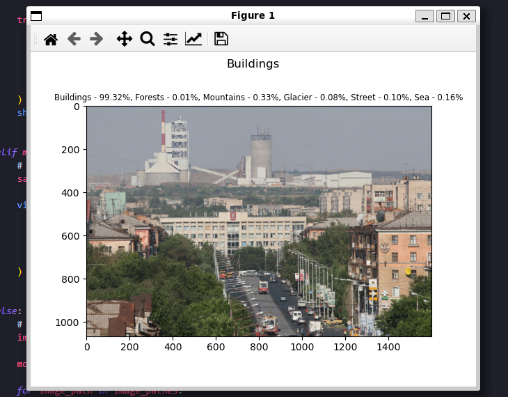
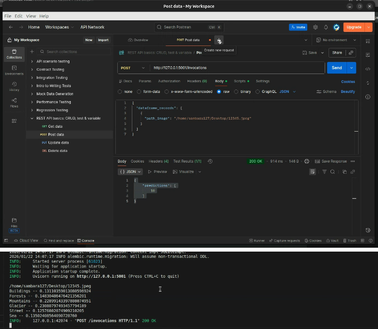

<small>Легендарная команда ЖАБИКИ представляет…</small>


# Проект «Классификация пейзажей»




Учебная задача классификации изображений, в которой необходимо обучить модель разделять картинки пейзажей на 6 категорий — <b>здания, леса, горы, ледники, улицы, и моря</b>.

Датасет на Kaggle: https://www.kaggle.com/datasets/nitishabharathi/scene-classification

Оттуда мы используем только часть Train (~17 тысяч картинок), поскольку в Test отсутствуют метки. В качестве нейронной сети для дообучения на данных используется <b>EfficientNetV2</b>.

<b>Описание проекта: https://docs.google.com/document/d/10K16Gk4J6S0RsSfetuY2jdKipEdf4N1YrAgXPLRn9cM/</b>

<b>Дорожная карта: https://docs.google.com/document/d/1DTn7W8wiueGiuZUKmumBUIkCw9Hp83DQ/</b>


## Установка

1. [Загрузите и установите менеджер сред Poetry, если он ещё не установлен](https://python-poetry.org/docs/#installing-with-the-official-installer)

2. Клонируйте репозиторий и перейдите в его корень

3. Создайте новое окружение Poetry:
    ```bash
    poetry config virtualenvs.in-project true
    poetry env use python3
    poetry install
    ```

4. Если у вас нет доступа к DVC проекта (для получения оного вы должны быть членом Великой и Неподражаемой команды ZHABIKI, так что, скорее всего, его у вас нет), вам нужно загрузить и распаковать датасет вручную:

    4.1. [Скачайте датасет с Kaggle](https://www.kaggle.com/datasets/nitishabharathi/scene-classification) (для скачивания требуется аккаунт).

    4.2. Распакуйте каталог `nitishabharathi` в корень каталога, указанного в значении параметра `path-data` (по умолчанию — каталог data/ в корне клонированного репозитория).

    4.3. Чтобы убедиться, что датасет загрузился корректно, можно измерить его размер в байтах. Так, выполнение команды `du -sb nitishabharathi` должно показать `397098665`.

5. Установите последнюю версию собранного модуля скрипта:
    ```bash
    source ./venv/bin/activate
    pip install -i https://test.pypi.org/simple/ paysage-classification
    deactivate
    ```

    **Вы также можете собрать модуль вручную, подробнее см. в Сборка.**

6. Настройте режим работы и другие параметры в `config.yaml`, либо воспользуйтесь параметрами по умолчанию.

    **Подробнее про настройку параметров см. в Параметры запуска.**

7. Если вы планируете использовать режим работы inference с графическим выводом, а также режим visualize, вам также потреубуется установить Tkinter:

    `sudo apt install python3-tk -y`

8. Перейдите в созданное окружение: `source .venv/bin/activate`

9. Наконец, запустите файл (`python3 ./main.py`) и, по желанию, визуализацию (**см. ниже**).

10. *Вы прекрасны!*


## Визуализация

Чтобы сравнивать обучение по эпохам и наблюдать за них на графиках в режиме реального времени, вы можете использовать **Tensorboard**. Для этого в соседнем окне терминала введите `tensorboard --logdir=runs` и перейдите по адресу `http://localhost:6006/`

Попимо этого, можно использовать **MLFlow**:
1. Запустите файл инициализации: `python3 ./log_to_mlflow.py`
2. Введите и выполните код, который вывел результат исполнения файла
3. Сервер готов к работе! Обращаться к нему можно через, например, Postman:




## Сборка

**Предполагается, что вы уже выполнили первые 4 шага из раздела Установка**.

1. Перейдите в созданное окружение: `source .venv/bin/activate`

2. Установите модули для сборки: `pip install setuptools wheel build`

3. Выполните разовую сборку и установку:
```bash
python3 -m build --wheel &&
wheel=$(ls ./dist) &&
pip install ./dist/$wheel &&
rm -rf ./dist
```

4. Если потребуется удалить пакет: `pip uninstall paysage_classification`

5. *Вуаля! Ничего сложного.*


## Параметры запуска

Файл <code>main.py</code>, при обращении к различным фукнциям модуля, использует ряд параметров, подлежащих пользовательской настройке в файле `config.yaml`.

В зависимости от режима работы, часть из них можно пропускать. Также можно полностью исключить аргументы настройки гиперпараметров модели (`e`, `bs`, `ss`) — в таком случае, будут использоваться те же параметры, что и заданные в файле по умолчанию.

Ниже идёт описание каждого из аргументов:

1. **`mode` — Режим работы программы**

    Всего есть 4 режима работы:
    - `train` — Тренировка новой модели на основе EfficientNetV2;
    - `test` — Тестирование обученной модели, вывод classification report;
    - `inference` — Выполнение инференса(-ов) при помощи обученной модели;
    - `visualize` — Визуализация классов датасета.

2. **`e` — Количество эпох обучения** (по умолчанию: 100)

    *Используется только в режиме работы `train`.*

    Обратите внимание, что обучение прервётся автоматически, если точность модели на эвалюации не будет расти более $th$ эпох.

3. **`bs` — Размер батча** (по умолчанию: 256)

    *Используется только в режимах работы `train` и `test`.*

4. **`ss` — Размер изображения** (по умолчанию: 88)

    *Не используется в режиме работы `visualize`.*

    Все изображения, будь то в датасете или во время инференса, будут автоматически приведены к этому размеру. При этом изображение не будет обрезано, произойдёт лишь растягивание или сжатие изображения под квадрат размером $ss \times ss$ пикселей.

    Очень важно, чтобы при использовании обученной модели этот параметр имел **то же значение**, что применялось при её обучении. В противном случае, выходная точность модели будет крайне низкой.

5. **`th` — Порог деградации модели** (по умолчанию: 10)

    *Используется только в режиме работы `train`.*

    Обучение будет автоматически прервано, если точность модели на эвалюации не будет расти более этого числа эпох. При этом будет сохранена та версия модели, которая имела наибольшую точность на эвалюации.

6. **`path-checkpoint` — Название файла весов обученной модели**

    *Используется только в режимах работы `test` и `inference`.*

    Полный путь до файла составляется как `path-models / path-checkpoint`.

7. **`path-data` — Путь до каталога с данными**

    В этом каталоге хранятся загруженный ранее набор данных, сплиты (если они были созданы), а также набор названий меток для классов `labels.txt`.

8. **`path-infers` — Путь до изображения или каталога для инференса**

    *Используется только в режиме работы `inference`.*

    Будут автоматически обработаны все изображения, находящиеся в каталоге. Если путь указывает не на каталог, а на файл, обработан будет только он.

9. **`path-models` — Путь до каталога с моделями**

    Используется в зависимости от режима работы:
    - При `train` — место сохранения новой модели (название будет дано автоматически на основе текущей даты, результата и гиперпарамтров);
    - При `test` и `inference` — часть пути до загрузки весов модели (полный путь формируется из `path-models` и `path-checkpoint`);
    - При `visualize` — не используется.

10. **`dataset-size` — Размер датасета в байтах** (по умолчанию: 397098665)

    В случае несовпадения размера, как и в случае полного отсутствия датасета, будет предприянта автоматическая попытка загрузить его с DVC.

    Измените значение этого параметра на 0, если вы хотите отключить проверку.

11. **`dataset-splits` — Пропорции сплитов** (по умолчанию: 0.7-0.2-0.1)

    *Используется только в режимах работы `train` и `test`.*

    Определеяет, какие пропорции использовать при создании нового сплита, если файлов со сплитами не существует. Состоит из трёх чисел от 0 до 1, разделённых дефисами (-) которые в сумме должны давать 1.0. Первое число соответствует числу семплов, которые будут использоваться в `train.csv`, второе — в `eval.csv`, а третье — в `test.csv`.

    **Если файлы сплитов уже существуют, этот параметр не будет использован.**

12. **`infer-output` — Режим вывода результатов инференса**

    *Используется только в режиме работы `inference`.*

    Всего есть 2 режима вывода:
    - `mpl` — Режим интерактивного окна MatPlotLib. В окне будут находиться изображение, наиболее вероятный класс, и проценты вероятности для всех классов;
    - `std` — Режим стандартного вывода (stdout). Текст будет содержать название файла, и проценты вероятности для всех классов в формате `Класс - 0.00%`. Можно перенаправить в файл стандартными средствами работы с потоками.


## Пример **минимальной** конфигурации: обучение на слабом ПК

```bash
params:
  mode: train
  e: 30
  bs: 64
  ss: 32 # = ss для inference
  th: 3
  path-data: data/
  path-models: models/
  dataset-size: 397098665
  dataset-splits: 0.7-0.2-0.1
```


## Пример **минимальной** конфигурации: инференс изображения

```bash
params:
  mode: inference
  ss: 32 # = ss для train
  path-checkpoint: my-model.pt
  path-infers: ~/Pictures/Bliss.jpeg
  path-models: models/
  dataset-size: 397098665
```
